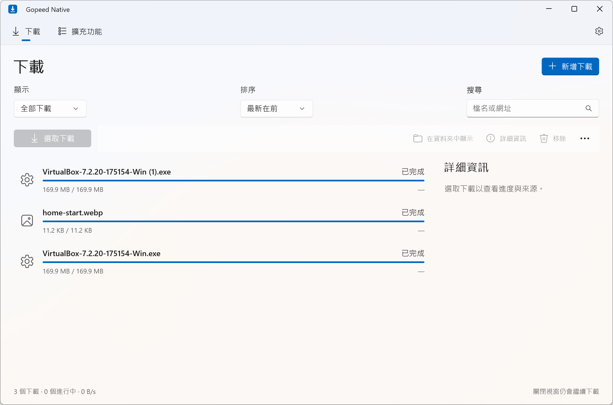

# Gopeed Native

[Gopeed](https://github.com/GopeedLab/gopeed) 的 Windows 原生前端，使用 **WinUI 3 + Go 下載引擎**，提供繁體中文介面、系統主題與獨立下載視窗。這是社群 fork，並非 Gopeed 官方發行版。

本專案維護在 **`winui-native` 分支**；`main` 保留上游內容。前端不用 Flutter 或 WebView，下載引擎固定在 Gopeed v1.9.3。



## 安裝

從 [v0.3.0 Release](https://github.com/tavricccc/gopeed-winui/releases/tag/v0.3.0) 下載：

- **GopeedNative-Setup-0.3.0-x64.exe**：安裝至目前使用者，建立開始功能表入口、自動連接官方瀏覽器擴充套件並註冊 `gopeed://`，不需要管理員權限。
- **GopeedNative-Portable-0.3.0-x64.zip**：完整解壓縮後執行 `Gopeed.Native.exe`；不註冊協定。
- **GopeedNative-Source-0.3.0.zip**：完整原始碼，包含固定版本的上游核心。

目前實測環境是 Windows 11 x64。前端採自包含部署，不需要另外安裝 .NET 或 Windows App SDK runtime。Windows 10 未完成實機驗證。

## 操作

主要操作跟著下載狀態變化，永遠放在第一位，並使用系統重點色：

| 狀態 | 主要操作 |
| --- | --- |
| 下載中／等待中 | 暫停下載 |
| 已暫停 | 繼續下載 |
| 下載失敗 | 重試下載 |
| 已完成 | 開啟檔案 |

完成視窗也提供「在資料夾中顯示」與「開啟檔案後關閉此視窗」。主清單雙擊已完成的項目可開啟檔案，其他狀態則顯示詳情。刪除任務時，可另外勾選刪除檔案，預設保留。

新增單一連結時，先檢查來源、大小與可選檔案，再確認儲存位置與檔名；多行連結可批次開始。可選擇分類、使用最近連結、調整 HTTP 方法／內容／標頭、代理、憑證驗證與解壓縮選項。HTTP 標頭可保留 Cookie、Referer 與 Sec-Ch-Ua 品牌引號。

清單支援搜尋、狀態篩選、日期／名稱／大小／進度排序，以及 Ctrl／Shift 多選與批次暫停、繼續、移除。失效的 HTTP 來源可手動修改，也可等待瀏覽器的新連結接續原任務。詳細資訊包含檔案清單、分享與連線資訊。完成後的解壓縮與 BT 做種狀態會持續更新。

| 快捷鍵 | 功能 |
| --- | --- |
| Ctrl+N | 新增下載 |
| Ctrl+F | 搜尋 |
| F5 | 更新清單 |
| Ctrl+A | 在清單全選 |
| Delete | 移除選取的下載 |

關閉視窗後，核心會留在系統匣繼續下載。從系統匣可重新開啟介面或停止核心；設定頁也提供結束操作。窄視窗會收合側邊詳情，保留「詳細資訊」按鈕。

## 官方瀏覽器擴充套件

安裝 Gopeed Native 與 [Gopeed 官方擴充套件](https://github.com/GopeedLab/browser-extension) 即可使用本機接管，**不必填伺服器位址或 Token**。安裝程式會為 Chrome、Edge 與 Firefox 註冊官方的 Native Messaging host；Chrome Web Store 與 Edge 商店版本都可使用。擴充套件保留預設的「遠端下載」關閉狀態即可。

如果之前已設定遠端下載，它仍可繼續使用；想改為本機接管，只需關閉擴充套件的遠端下載。被其他 Gopeed 安裝改寫註冊時，可在設定的「瀏覽器接管」按「啟用瀏覽器下載接管」。Portable 版也可透過這個按鈕啟用，之後請保留原資料夾位置。

擴充套件送來的下載會先開獨立確認窗，按下「開始下載」後才建立任務；取消不會下載。開始後同一視窗顯示進度，完成時第一個按鈕變成「開啟檔案」。主清單沒有開啟時，也只顯示這個下載窗。

也接受官方 `gopeed:///create?params=…` 與 `gopeed:///extension?params=…` 連結。進階的本機 HTTP 連線資訊放在「遠端下載連線」展開區，不影響一般接管使用。

## 資料與解除安裝

資料、偏好與持久 API Token 位於 `%LOCALAPPDATA%\GopeedNative`，與官方 Gopeed 的資料分開。核心只監聽本機介面，API 保持 Token 驗證。請勿公開 session、Token、Cookie 或暫存請求內容。

解除安裝會停止下載、移除本程式的整合註冊，還原安裝前的瀏覽器 host，保留任務資料與下載檔案。若要完全清除，可在結束核心後手動刪除資料夾。其他 Gopeed 安裝可能改寫共用的本機 host 與 `gopeed://`，需要時可在設定重新啟用接管。

## 開發

準備 **Windows、PowerShell 7、Go 1.27、.NET 10 SDK**；製作安裝程式另需 Inno Setup 6，腳本預設尋找其目前使用者安裝位置。

```powershell
git clone --branch winui-native --recurse-submodules https://github.com/tavricccc/gopeed-winui.git
cd gopeed-winui
pwsh -File scripts/build.ps1 -Test
pwsh -File scripts/package.ps1
pwsh -File scripts/source.ps1
```

已取得的 checkout 可執行 `git submodule update --init --recursive`。建置產物位於 `artifacts/`。重新建置之前先關閉從該產物執行的前端與核心，避免檔案鎖定。

- `upstream/`：Gopeed v1.9.3，固定 commit `a5cd53f94c18ac65add684b1113fa5f0b47cc4da`。
- `core/`：Go API、瀏覽器確認入口、系統匣、持久 Token 與關閉時的狀態保存。
- `src/Gopeed.Native/`：原生頁面、ViewModel、模型與服務；確認窗與主介面共用 DownloadForm。
- `tests/Gopeed.ProtocolChecks/`：協定、標頭換行與狀態動作的必要檢查。
- `scripts/`：建置、圖示生成與每使用者安裝包。
- `DESIGN.md`：原生介面及素材來源；[CONTRIBUTING.md](CONTRIBUTING.md) 說明參與方式。

Windows GitHub Actions 會建置自包含前端、核心與瀏覽器 host、執行必要檢查，並製作 installer 與 portable 產物。詳見 [Actions](https://github.com/tavricccc/gopeed-winui/actions)。

## 驗證範圍

已驗證 Token 驗證、HTTP 建立／暫停／重啟續傳／SHA-256／移除任務，並實際測試 WinUI 下載確認、狀態動作與關閉前端後背景下載。VirtualBox 的 HTTP 下載已通過官方 SHA-256 比對；CR、LF、CRLF 標頭解析檢查通過。

原版功能對照與個別驗證範圍見 [功能對照](docs/feature-parity.md) 與 [0.3.0 驗證紀錄](docs/verification-0.3.0.md)。BT/eD2k 真實網路、第三方擴充功能的網站解析、Narrator、高對比與跨應用程式拖放仍需實機驗證。原生前端的 RAM 快照不能視為跨硬體保證，也沒有與官方版本同工作量的對照結論。

## 授權

GPL-3.0，見 [LICENSE](LICENSE)。下載引擎來自 GopeedLab/gopeed，保留上游授權與來源。Release 提供包含 submodule 內容的完整原始碼；GitHub 自動產生的 Source code ZIP 不包含 submodule，請使用附加的完整來源 ZIP 或遞迴 clone。
